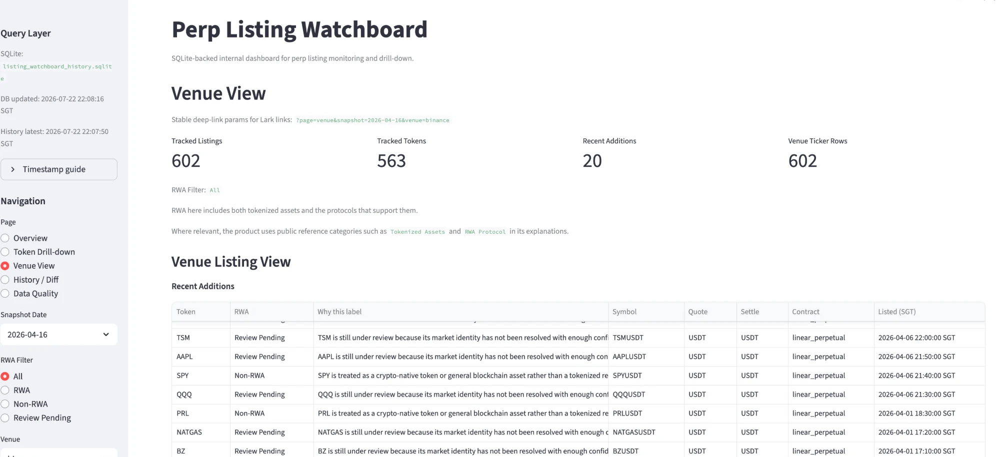
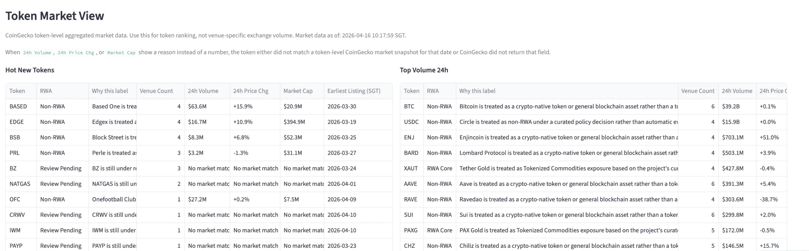

# Listing Monitor

> 一个轻量、文件驱动的 perp listing intelligence 项目。

从交易所抓取新上币信号，经过清洗、CoinGecko 富化、RWA 标注、质量审计与归档，最终推送到 Lark 卡片并在 Streamlit dashboard 上可视化。整条 pipeline 以本地文件为中心，无需常驻服务。

**🔗 Live Demo:** <https://cross-exchange-listing-monitor.streamlit.app/?page=overview>

## 预览 / Screenshots

> Live Demo 托管在 Streamlit 免费版，休眠时首次打开需约 30 秒唤醒。下面两张静态截图可先睹为快。

**Venue View —— 规模与跨所覆盖**



统一的 SQLite query layer 驱动：602 条 tracked listings、563 个 token，跨 binance / bybit / okx / bitget / hyperliquid 多所监控。

**Token Market View —— 透明的 RWA 分类逻辑**



每个 token 都带 RWA 标签（RWA Core / Non-RWA / Review Pending）与 “Why this label” 判定理由，分类结果对用户可解释、可追溯。

## Pipeline 概览

```text
ingestion ──► transform ──► quality ──► delivery / app
  抓取上币      清洗 + 富化     数据审计     Lark 推送 / dashboard
```

按 pipeline 分层的目录职责：

| 目录              | 职责                                              |
| ----------------- | ------------------------------------------------- |
| `src/ingestion/`  | 交易所抓取与 listing 检测                         |
| `src/transform/`  | 清洗、CoinGecko enrich、RWA 标注、归档、SQLite query layer |
| `src/quality/`    | 数据质量审计                                      |
| `src/delivery/`   | Lark 推送层                                        |
| `src/app/`        | Streamlit dashboard                               |
| `config/`         | 显式配置，如 CoinGecko override map               |
| `data/`           | raw / cache / processed / marts / audits / history / db |

## 目录

- [Quick Start](#quick-start)
- [Directory Layout](#directory-layout)
- [Architecture Notes](#architecture-notes)
- [Environment](#environment)
- [Makefile](#makefile)
- [Core Files](#core-files)
- [Run The Pipeline](#run-the-pipeline)
- [RWA Labeling](#rwa-labeling)
- [Daily Snapshot And SQLite Query Layer](#daily-snapshot-and-sqlite-query-layer)
- [Lark Delivery](#lark-delivery)
- [Streamlit Dashboard](#streamlit-dashboard)
- [Public Beta Deployment](#public-beta-deployment)
- [Backward Compatibility Notes](#backward-compatibility-notes)
- [Git Hygiene](#git-hygiene)

## Quick Start

```bash
# 1. 安装锁定依赖
pip install -r requirements.txt

# 2. 配置环境变量
cp .env.example .env   # 然后填入 LARK_WEBHOOK_URL 等

# 3. 刷新数据并跑一遍 pipeline
make all

# 4. 启动本地 dashboard
make ui
```

## Directory Layout

```text
listing-monitor/
  README.md
  .env
  .env.example
  .gitignore

  config/
    coingecko_overrides.py
    rwa_allowlist.csv

  docs/
    architecture/
      Listing Monitor架构walkthrough.md
      listing_monitor_review_prompt.md

  src/
    ingestion/
      hl_listing_monitor.py
      fetch_venue_ticker_metrics.py
    transform/
      clean_watchboard.py
      enrich_watchboard_coingecko.py
      label_rwa_tokens.py
      archive_daily_snapshot.py
      build_history_store.py
    quality/
      audit_watchboard_quality.py
    delivery/
      lark_listing_watchboard.py
    app/
      streamlit_app.py
      watchboard_query.py
    common/
      paths.py

  data/
    raw/
    cache/
    processed/
    marts/
    audits/
    history/
    db/
```

## Architecture Notes

Project architecture and review context are archived in `docs/architecture/`:
- `Listing Monitor架构walkthrough.md`：comprehensive architecture walkthrough and Claude review output
- `listing_monitor_review_prompt.md`：the review prompt used to generate the architecture assessment

These files are documentation only; they do not affect the runtime pipeline.

## Environment

安装依赖：

```bash
pip install -r requirements.txt
```

创建 `.env`：

```bash
cp .env.example .env
```

填入：

```env
LARK_WEBHOOK_URL=https://open.larksuite.com/open-apis/bot/v2/hook/your-webhook
WATCHBOARD_DASHBOARD_URL=http://localhost:8511/?page=overview
WATCHBOARD_HISTORY_DIFF_URL=http://localhost:8511/?page=history
```

说明：

- 所有脚本都通过 `src/common/paths.py` 按项目根目录解析路径，不依赖当前工作目录。
- `lark_listing_watchboard.py` 仍然支持 `--webhook` 显式覆盖 `.env`。
- Streamlit Community Cloud 的 public beta 不需要 `.env` 或 Secrets。

## Makefile

常用入口已经收进 `Makefile`：

| 命令             | 作用                                                                 |
| ---------------- | -------------------------------------------------------------------- |
| `make listings`  | 刷新 listing state 和 `data/raw/listing_watchboard.csv`，不推 Lark   |
| `make clean`     | 清洗 watchboard                                                      |
| `make market`    | CoinGecko enrich + 生成 leaderboard marts                           |
| `make rwa`       | 生成 token-level RWA labels 与 review queue                         |
| `make tickers`   | 抓取 venue ticker metrics                                            |
| `make metrics`   | token metrics / leaderboard（由 `market` 步骤生成）                  |
| `make audit`     | 数据质量审计                                                        |
| `make archive`   | 归档当日输出到 `data/history/`                                       |
| `make db`        | 构建 SQLite query layer                                              |
| `make lark`      | 推送每日 Lark 卡片                                                   |
| `make ui`        | 启动本地 Streamlit dashboard                                         |
| `make ui-lan`    | 在局域网内启动 dashboard（`0.0.0.0:8511`）                           |
| `make pipeline`  | `clean + market + rwa + tickers + metrics + audit + archive + db`   |
| `make daily`     | `pipeline + lark`                                                    |
| `make all`       | `listings + pipeline`                                                |

推荐日常用法：

```bash
make all     # 刷新上币信号并跑完整 pipeline
make daily   # 跑 pipeline 并推送 Lark
make ui      # 启动 dashboard
```

## Core Files

主要数据层：

- `data/raw/known_listings.json`
- `data/raw/listing_watchboard.csv`
- `data/cache/coingecko_coin_details_cache.json`
- `data/processed/listing_watchboard_clean.csv`
- `data/processed/token_market_metrics.csv`
- `data/processed/token_rwa_labels.csv`
- `data/processed/token_rwa_review_queue.csv`
- `data/processed/venue_ticker_metrics.csv`
- `data/processed/listing_watchboard_token_metrics.csv`
- `data/marts/top_volume_tokens.csv`
- `data/marts/top_gainers_tokens.csv`
- `data/marts/top_losers_tokens.csv`
- `data/marts/hot_new_tokens.csv`
- `data/audits/listing_coverage_audit.csv`
- `data/audits/token_market_match_audit.csv`
- `data/audits/token_market_metrics_audit.csv`
- `data/db/listing_watchboard_history.sqlite`

语义约定：

- `token_market_metrics.csv` = CoinGecko token-level aggregated market data。
- `token_rwa_labels.csv` = token-level RWA classification keyed primarily by `coingecko_id`。
- `venue_ticker_metrics.csv` = exchange-specific perp/swap/futures metrics。
- 不要把 CoinGecko `volume_24h_usd` 理解成某个交易所的 venue 成交量。

## Run The Pipeline

最常用的一条本地 pipeline：

```bash
python src/transform/clean_watchboard.py
python src/transform/enrich_watchboard_coingecko.py
python src/transform/label_rwa_tokens.py
python src/ingestion/fetch_venue_ticker_metrics.py
python src/quality/audit_watchboard_quality.py
python src/transform/archive_daily_snapshot.py --overwrite
python src/transform/build_history_store.py
```

> 等价于 `make pipeline`。下面按步骤拆解每一环的行为。

### Listing Detection

Hyperliquid / multi-venue listing monitor：

```bash
python src/ingestion/hl_listing_monitor.py snapshot --venue all
python src/ingestion/hl_listing_monitor.py daily-summary --venue all
python src/ingestion/hl_listing_monitor.py poll --venue all
```

行为说明：

- 首次运行会初始化 `data/raw/known_listings.json`，并且**不发告警**。
- 后续运行检测新增 listings 并推送 Lark。
- `snapshot --venue all` 会做一次性 listing state / raw watchboard 刷新，不推送 Lark。
- `poll --venue all` 会在一个进程里顺序检查各 venue，避免多个进程并发写同一状态文件。

### Cleaning

```bash
python src/transform/clean_watchboard.py
```

输入 / 输出：

- 输入：`data/raw/listing_watchboard.csv`
- 输出：`data/processed/listing_watchboard_clean.csv`

### CoinGecko Enrichment And Leaderboards

```bash
python src/transform/enrich_watchboard_coingecko.py
```

输出：

- `data/processed/token_market_metrics.csv`
- `data/processed/listing_watchboard_token_metrics.csv`
- `data/marts/top_volume_tokens.csv`
- `data/marts/top_gainers_tokens.csv`
- `data/marts/top_losers_tokens.csv`
- `data/marts/hot_new_tokens.csv`
- `data/audits/token_market_match_audit.csv`
- `data/audits/token_market_metrics_audit.csv`

### RWA Labeling

```bash
python src/transform/label_rwa_tokens.py
```

输出：

- `data/processed/token_rwa_labels.csv`
- `data/processed/token_rwa_review_queue.csv`
- `data/cache/coingecko_coin_details_cache.json`

V1 规则：

- 主键优先使用 `coingecko_id`，不依赖 symbol 作为唯一分类键
- 优先级严格为：
  - `manual_override`
  - `seed_allowlist`
  - `cached_coingecko_categories`
  - `conservative_keyword_fallback`
- CoinGecko detail cache 只会对前两层都未命中的 coin ID 拉取并缓存
- public CoinGecko 额度较紧时，detail cache 会按小批量渐进预热；一旦确认持续 `429`，本轮会停止继续拉取并直接落地标签结果
- 主流稳定币默认排除为 `non_rwa`
- 证据冲突或边界模糊时使用 `review_pending`
- `token_rwa_review_queue.csv` 只聚焦 `review_pending`，并优先按 `24h volume`、`market cap`、再按是否存在 keyword/category 证据排序，便于运营先看高价值待复核 token

当前 `config/rwa_allowlist.csv` schema：

- `coingecko_id`
- `rwa_label`
- `rwa_category`
- `protocol`
- `force_override`
- `notes`

### Venue Ticker Metrics

```bash
python src/ingestion/fetch_venue_ticker_metrics.py
```

输出：

- `data/processed/venue_ticker_metrics.csv`

当前 resilience 行为：

- 每个 venue 最多重试 3 次，按 `1s / 2s / 4s` exponential backoff。
- 单个 venue 最终失败时，不会中断整条 ticker pipeline；其他 venue 继续处理。
- 如果本地已有上一份成功的 `venue_ticker_metrics.csv`，失败 venue 会优先复用上一份该 venue 的 rows，并标记为 stale fallback。
- `venue_ticker_metrics.csv` 会额外写出：`fetch_status`、`snapshot_time`、`data_freshness`、`source_error`。

### Quality Audit

```bash
python src/quality/audit_watchboard_quality.py
```

输出：

- `data/audits/listing_coverage_audit.csv`
- `data/audits/token_market_metrics_audit.csv`

## Daily Snapshot And SQLite Query Layer

归档当前日输出：

```bash
python src/transform/archive_daily_snapshot.py --overwrite
```

会复制当前主要结果到 `data/history/YYYY-MM-DD/`。

构建 SQLite query layer：

```bash
python src/transform/build_history_store.py
```

SQLite 文件：`data/db/listing_watchboard_history.sqlite`

当前表层次：

- `listing_snapshots`
- `token_market_metrics_daily`
- `token_rwa_labels_daily`
- `venue_ticker_metrics_daily`
- `token_metrics_daily`
- `leaderboard_daily`

RWA 查询例子：

```sql
-- 最新一版 review queue
SELECT
  snapshot_date,
  token,
  coingecko_id,
  rwa_label,
  rwa_category,
  confidence,
  label_source
FROM token_rwa_labels_daily
WHERE snapshot_date = (SELECT MAX(snapshot_date) FROM token_rwa_labels_daily)
  AND rwa_label = 'review_pending'
ORDER BY confidence ASC, token ASC;
```

```sql
-- 某天的 core / related RWA token
SELECT
  l.snapshot_date,
  l.token,
  l.coingecko_id,
  l.rwa_label,
  l.rwa_category,
  l.protocol,
  t.venue_count,
  t.volume_24h_usd
FROM token_rwa_labels_daily l
LEFT JOIN token_metrics_daily t
  ON l.snapshot_date = t.snapshot_date
 AND l.token = t.token
WHERE l.snapshot_date = '2026-04-15'
  AND l.rwa_label IN ('core', 'related')
ORDER BY l.rwa_label, t.volume_24h_usd DESC, l.token ASC;
```

人工复核工作流：

- 每天优先查看 `token_rwa_labels_daily` 中 `rwa_label = 'review_pending'` 的 token
- 核对对应 `coingecko_id`、CoinGecko categories、项目描述与官网定位
- 如果结论明确，把 coin ID 写入 `config/rwa_allowlist.csv`
- 若必须强制纠偏，设置 `force_override = true`

## Lark Delivery

推送每日卡片：

```bash
python src/delivery/lark_listing_watchboard.py
```

临时覆盖 webhook：

```bash
python src/delivery/lark_listing_watchboard.py --webhook "https://open.larksuite.com/open-apis/bot/v2/hook/another-webhook"
```

卡片当前聚焦：

- `New Listings 24h`
- `Hot New Tokens`
- `Top Volume 24h`
- `Top Movers 24h`

并明确区分：

- **Token Market View** = CoinGecko token-level aggregated market data
- **Venue Perp View** = exchange-specific perp/swap/futures metrics

## Streamlit Dashboard

> 在线体验：<https://cross-exchange-listing-monitor.streamlit.app/?page=overview>

启动本地 dashboard：

```bash
python3 -m streamlit run src/app/streamlit_app.py
# 或
make ui
```

主要页面：

- `Overview`
- `Token Drill-down`
- `Venue View`
- `History / Diff`
- `Data Quality`

常用 deep links：

```text
http://localhost:8511/?page=overview&snapshot=2026-04-14
http://localhost:8511/?page=token&snapshot=2026-04-14&token=SUI
http://localhost:8511/?page=venue&snapshot=2026-04-14&venue=binance
http://localhost:8511/?page=history&snapshot=2026-04-14&token=SUI
http://localhost:8511/?page=quality&snapshot=2026-04-14
```

## Public Beta Deployment

部署路径为 `GitHub repository → Streamlit Community Cloud`。当前线上入口为 [Live Demo](https://cross-exchange-listing-monitor.streamlit.app/?page=overview)。

| 配置项 | 值 |
| --- | --- |
| Branch | `codex/public-beta-streamlit` |
| Main file | `src/app/streamlit_app.py` |
| Data source | 已提交的 `data/history/YYYY-MM-DD/*.csv` 快照 |
| Secrets | 当前 public beta 不需要 |

Cloud 首次启动会从历史快照重建只读 SQLite query layer；不要提交本地 `.env`、Secrets、缓存或 SQLite 文件。

### Share Demo On Local Network

如果你想在同一个局域网里给同事演示：

```bash
make ui-lan
```

然后让同事打开：

```text
http://<your-lan-ip>:8511
```

注意：

- 同事需要和你在同一个 LAN / Wi‑Fi 网络里。
- macOS / Windows 防火墙可能需要允许 `8511` 入站连接。
- `.streamlit/config.toml` 里提供了一个 LAN 示例配置；如果你的局域网 IP 变化了，需要把 `browser.serverAddress` 改成当前机器的 IP。

## Backward Compatibility Notes

- 旧的根目录脚本路径已经迁移到 `src/...`。
- 旧的数据文件路径已经迁移到 `data/...`。
- `data/processed/listing_watchboard_enriched.csv` 作为 legacy 输出保留，但不再是主要 source of truth。
- 如果你之前有手工脚本或 cron 指向旧路径，需要改成新的 `src/...` 命令。

## Git Hygiene

推荐纳入版本管理的内容：

- `README.md`、`.gitignore`、`.env.example`、`Makefile`
- `config/`、`src/`
- `data/*/.gitkeep`
- 其他代码、配置、文档类文件

不建议提交：

- `.env` 及其他 `.env.*` secrets 文件
- `.streamlit/secrets.toml`
- `*.sqlite` / `*.db` 本地数据库
- `*.log`、`logs/` 等本地运行日志
- `data/raw/*`、`data/cache/*`、`data/processed/*`、`data/marts/*`、`data/audits/*`、`data/db/*`
- 本地 IDE / Python 缓存目录，如 `.vscode/`、`.idea/`、`__pycache__/`、`.venv/`

public beta 的一个例外：可以提交少量 `data/history/YYYY-MM-DD/*.csv` 快照，作为 Streamlit Community Cloud 的只读展示数据来源。

推荐初始化方式：

```bash
git init
git add README.md .gitignore .env.example Makefile config src \
  data/raw/.gitkeep data/processed/.gitkeep data/marts/.gitkeep \
  data/audits/.gitkeep data/history/.gitkeep data/db/.gitkeep
git commit -m "Initial listing monitor pipeline structure"
```

首次推送到远程：

```bash
git branch -M main
git remote add origin <your-repo-url>
git push -u origin main
```
